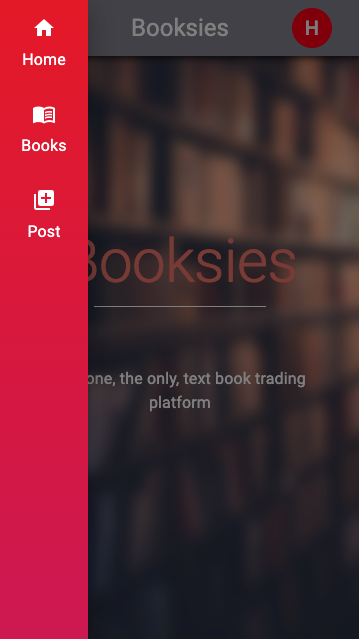

# Booksies

> A College book sharing application to help students cut out a big step in finding new books

## Features

> User login and personal settings

> Easy to use and understand UI/UX

> Book matching that makes sense

## Visions

> Messaging application for users to be able to communicate

> Receipts for any misunderstandings or malicious intent

## Team

> Gabriel Murray

> Heath Banner

> Guy McCrary III

## This application is still under construction

We hope to be able to finish this by the end of February so we may beta testing.

## Contact

If you wish to contact us, you may email me at heathbanner@outlook.com